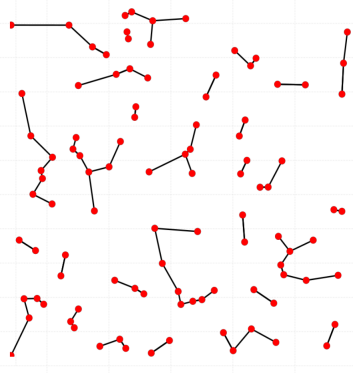
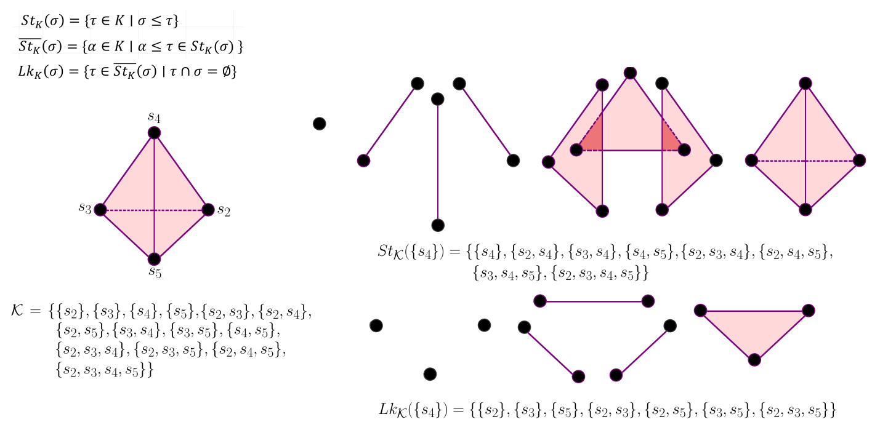
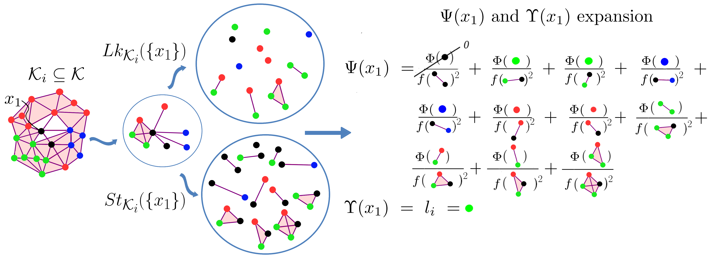
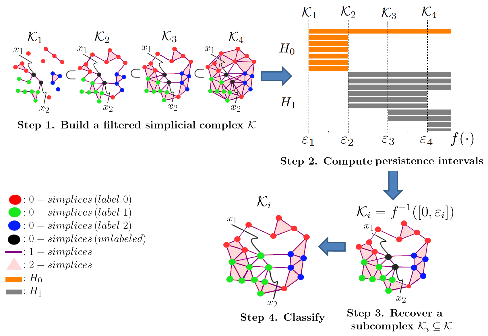

# TDA-based-classifier Implementation
This implements a method to apply Topological Data Analysis (TDA) as a classifier.

# Description:

The overall idea is to use variable sized neighborhoods to perform the classification instead of
using a fixed collection of points as the kNN family of methods does.

When you connect each point of your point cloud with its k nearest-neighbors, you will get a nearest-neighbors graph as we show in the figure:

Now, from a mathematical point of view, we know that a graph is a 1-dimensional simplicial complex. A graph is also the
1-skeleton of any simplicial complex. In terms of TDA, the k-NN neighorhoods are collection of k 0-simplices (points).
So, why we need to maintain the elements in each collecton fixed (k elements), and why those elements needs to be
only 0-simplices (points). Actually, nothing prevents you from generalizing it.
Our approach was to generalize the nearest-neighbors graph to be the entire the nearest-neighbors simplicial complex.
Now, a neighbor will be a simplex and not just a point, and also you can querying neighbors from a simplices too.
Then the Star and Link of a simplex comes to scene. Let $K$ be a simplicial complex and $\sigma \in K$ a q-simplex.
The $star(\sigma)$ is the collection of simplices that contains $\sigma$. The star is not a simplicial complex because
all missing faces. The $link(\sigma)$ is the collection of simplices that we need to add to turn the star(\sigma) in a
simplicial complex called the closed star. The Figure show both concepts:

The star and link of simplices give us the simplicial neighborhoods of a simplex in a simplicial complex. As we know, some points in
our dataset will be labeled and the remaining ones unlabeled. So we need to figured out how to propagate labels from
labeled to unlabeled points. Well, we can to consider simplices as relationships between points at different orders. So a 1-simplex
(edge) means the classical relationship between two points, a 2-simplex (triangle) a relationship between tree points,
and so on with high dimensional simplices we get high order relationships between points.
Thus, to label a point p, we can counting the contributions of each neighbor of p. WE compute the link or the star,
and per simplex we ask its contribution, at the end we got the contributions of the labeled points several times,
as much as the number and dimensionality of the simplices that its belongs inside the neighborhood of p.
The overall, the labeling approach is summarized in the following Figure:

This solution enrich the information that we can analyze from our data, and give us more insight. However,
a big issue remains, how can we be sure that our simplicial complex actually represents our data? This question arises
from the fact that we can build high number of simplicial complexes from the same point cloud.
Even with the chosen type of simplicial complex Cech, Rips, Alpha, Witness all of them use a threshold value to obtain
the simplices in a given level of proximity. So, which is the threshold value that we need to use in order to
obtain a simplicial complex that accurate represent the structure of our dataset.

This is a old problem, which has been studied in TDA. The common approach is to forget of any specific threshold
and working with all of them up to a maximum defined threshold value. The idea is to explore every
simplicial complex in each scale of the threshold value. What we get is a nested and increased collection of
simplicial complexes each one containing the previous ones. This is called a filtration. Then we can use the TDA
working horse "Persistent Homology (PH)" which is a technique capable to capture and understand the evolution history of
topological features conforming the threshold value is increased. The process that we follow here, was to use PH
to understand topologically our dataset and using that information to extract a simplicial complex from the filtration
which approximates well enough our dataset. Then, use the aforementhioned propagation method in that sub-complex.

The overall process is summarized in the Figure:

# How to use it:

## Dependencies

There is a req.txt file automatically generated but it can be installed manually. We also provide a ipynb file to run.

1. Install Anaconda
2. make a new environment

conda create --name tdabc_env

3. Install gudhi according to (https://gudhi.inria.fr/python/latest/installation.html). 
   We choose the conda instalation way: 

conda install -c conda-forge gudhi

4. Install scikit-learn

conda install -c conda-forge scikit-learn

5. Install matplotlib

conda install -c conda-forge matplotlib

para que funcione con latex

sudo apt install texlive-fonts-recommended 
texlive-fonts-extra

sudo apt install dvipng

6. Install umap (optional). 
   In case your want to install it, you need to 
   downgrade your python to python 3.8, and every 
   package as well to be compatible with this version. 
   
conda install -c conda-forge umap-learn
pip install umap-learn

7. Install h5py

conda install -c conda-forge h5py

## Tutorial

the entry point is the main.py

to run the project it is enough with:

python main.py

however the main accepts arguments to configure the execution:

usage: main.py [-h] [-o OPTION] [-d DATASET] [-path PATH] [-i ITERATION] [-n NUMBER_DATASETS] [-m METRIC] [-t TRANSFORMATION]

Where:

-> -o --option help="Select option to execute 1: Multi KRNN experiment, 2: KRNN, 3: Conventional experiment " type=int

-> -d --dataset help="Select the datasets" type=int

-> -path --path help="Define folder to save results" type=str

-> -i --iteration" help="Iteration number for option=1" type=int

-> -n --number_datasets help="Number of datasets for option=1 type=int

-> -m --metric help="Metric to build the simplicial comples. A collection of possible  metrics are: ['cityblock', 'cosine', "
                                                   "'euclidean', 'l1', 'l2', 'manhattan', 'nan_euclidean','braycurtis',"
                                                   " 'canberra', 'chebyshev','correlation', 'dice', 'hamming', 'jaccard',"
                                                   " 'kulsinski', 'mahalanobis', 'minkowski', 'rogerstanimoto', "
                                                   "'russellrao', 'seuclidean', 'sokalmichener', "
                                                   "'sokalsneath', 'sqeuclidean', 'yule']" type=str

-> -t --transformation help="Data Transformation type to apply, types are: 0=NONE, SIMPLE=1, SQUARED=2, NLOG=3, NORM=4, INV=5, ELOG=6, REDUCTION=7" type=int

When select a data transformation of reduction, it means that you want to perform a dimensionality reduction, we
implement three algorithms PCA=0, TSNE=1, and UMAP=2 there is not interface to access to those method from the entry point.

### Execution

- To run the experiment in the eight datasets:

python main.py -o 3 -p YOUR_RESULT_PATH

you can also define -m YOUR_DESIRED_METRIC but it is optional because the euclidean distance is default.

- To run the experiment of generating the results of all datasets (Figure 7 in the paper)

python main.py -o 1 -i 1 -p "./docs/ADAC_TDABC_RESULTS"

This option 1 what does is to collect all dataset info inside the path directory and looking for *metrics.txt files
which are where all metric results are stored. Note that this method, assumes all datasets folder has the same number
of experiements.

To generate the RKNN experiments with 16 variations of samples, we need to provide the folder where all KRNN datasets
are stored. The algorithms detects by itself according to the structure of data if its the case of datasets
or the KRNN one.

To RUN the RKNN experiment, we must specify the iterations that we need to consider.

python main.py -o 1 -i 3 -n 16 -p "./docs/KRNN_EXPERIMENTS"

Generates n datasets 50:50, 50:100, 50:150, ..., 50:800 and executes i iterations of each one of our TDABC
and also generate the plots.

NOTE that both experiments with option -o 1 are mutually excluyent and they should not run on the same directory

Any comment, please do not hesitate to write a mail to Rolando Kindelan Nuñez ( rolan2kn@gmail.com , rkindela@dcc.uchile.cl), twitter: @rolan2kn.

# Reference:
Gatys, Leon A., et al. “A Neural Algorithm of Artistic Style.” ArXiv.org, 2 Sept. 2015, arxiv.org/abs/1508.06576.

